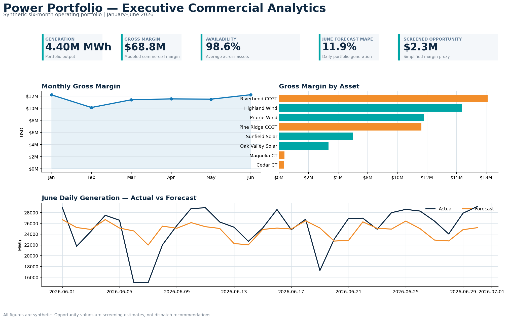
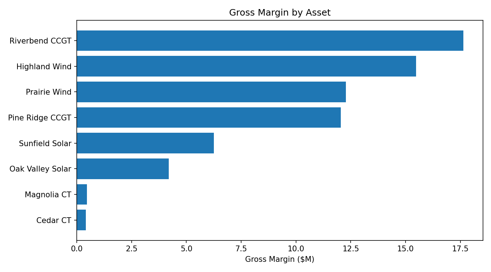
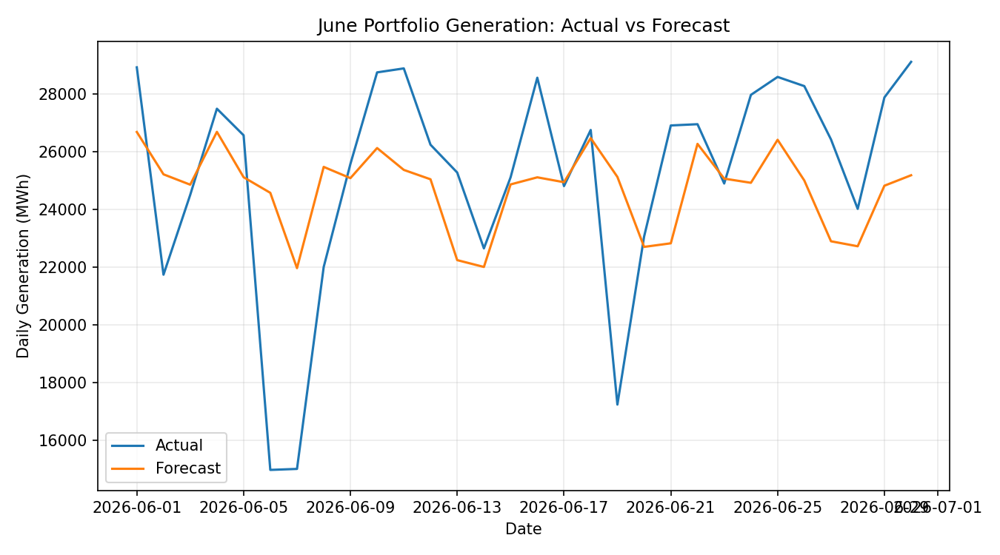

# Power Portfolio Commercial Operations Analytics

An end-to-end analytics case study connecting **power-asset operations, market prices, forecasting, commercial margin, data quality, and Power BI-ready semantic metrics**.

> **Data disclaimer:** Every asset, market price, fuel price, outage, forecast, and financial result in this repository is synthetic. This project does not contain Southern Company data or any proprietary utility information.



## Analytics at a glance

| Metric | Result | Interpretation |
|---|---:|---|
| Generation | **4.40M MWh** | Output across eight fictional assets over six months |
| Modeled gross margin | **$68.8M** | Commercial margin after simulated variable production costs |
| Portfolio availability | **98.6%** | Strong availability with asset-level operating differences |
| June forecast MAPE | **11.9%** | Daily portfolio forecast error on the held-out month |
| Screened margin opportunity | **$2.3M** | Simplified opportunity proxy; not a dispatch recommendation |

### Explore the analysis

1. **[Executive case study](notebooks/00_executive_case_study.ipynb)** — KPI design, findings, and portfolio decisions
2. **[Data quality and KPIs](notebooks/01_data_quality_and_kpis.ipynb)** — validation controls and reconciled metrics
3. **[Commercial operations analysis](notebooks/02_commercial_operations_analysis.ipynb)** — asset performance, margin, market capture, and headroom
4. **[Forecasting and opportunity screen](notebooks/03_forecasting_and_opportunity_screen.ipynb)** — holdout performance, feature importance, and screened value

Reusable logic is available in **[SQL](sql/)** and **[Python](src/)**, with governed metric definitions in the **[KPI dictionary](docs/KPI_DICTIONARY.md)** and a **[Power BI build guide](powerbi/POWER_BI_BUILD_GUIDE.md)**.

## Why this project

Commercial operations teams translate operating and market data into repeatable decisions: portfolio scorecards, asset drill-downs, forecasts, commercial performance views, and opportunity screens. This repository demonstrates that workflow with reproducible SQL/Python analysis and a Power BI design.

## Questions answered
1. Which assets and technologies are driving gross margin?
2. How do availability, utilization, and curtailment affect portfolio performance?
3. What market prices are assets actually capturing?
4. How accurate are generation forecasts, and where do errors concentrate?
5. When do attractive market spreads coincide with unused operating headroom?
6. How should core KPIs be governed for recurring executive reporting?

## Project contents

| Area | Start here | What it contains |
|---|---|---|
| Dashboard | [`assets/executive_overview.png`](assets/executive_overview.png) | Executive KPI, margin, asset, and forecast view |
| Notebooks | [`notebooks/00_executive_case_study.ipynb`](notebooks/00_executive_case_study.ipynb) | Notebook-style analytical narrative |
| SQL | [`sql/01_portfolio_kpis.sql`](sql/01_portfolio_kpis.sql) | Portfolio, asset, market, forecast, value, and QA queries |
| Power BI | [`powerbi/POWER_BI_BUILD_GUIDE.md`](powerbi/POWER_BI_BUILD_GUIDE.md) | Semantic model, DAX, and four-page report design |
| Governance | [`docs/DATA_GOVERNANCE_AND_QA.md`](docs/DATA_GOVERNANCE_AND_QA.md) | KPI ownership, validation, and reporting controls |
| Reproducibility | [`src/generate_synthetic_data.py`](src/generate_synthetic_data.py) | Deterministic data generation and analytics pipeline |

## Technical workflow
**1. Data model**  
Model a one-row-per-asset-hour fact table and an asset dimension.

**2. Data quality**  
Validate business-key uniqueness, non-negative generation, nameplate limits, availability flags, and KPI reconciliation.

**3. Commercial analytics**  
Calculate revenue, variable production cost, gross margin, margin/MWh, market capture, availability, capacity factor, and curtailment.

**4. Forecasting**  
Build a portfolio daily-generation forecast using market, fuel, calendar, and lagged production features; hold out June 2026 for evaluation.

**5. Opportunity screening**  
Flag simulated thermal hours where positive economic spread coincides with unused capacity, then estimate a conservative incremental-margin proxy.

**6. BI / semantic layer**  
Define reusable DAX measures and a four-page Power BI dashboard design for executive, operations, commercial, and forecasting views.

## Selected visuals
### Asset gross margin


### Forecast performance


## Tools
- Python: pandas, NumPy, scikit-learn, matplotlib
- SQL: reusable KPI, commercial-performance, forecast, opportunity, and QA queries
- Power BI: star-schema design, DAX measures, executive dashboard specification
- Git/GitHub: version-controlled analytics logic and documentation

## Run locally
```bash
python -m venv .venv
source .venv/bin/activate   # Windows: .venv\Scripts\activate
pip install -r requirements.txt
python src/generate_synthetic_data.py
python src/validate_data.py
python src/build_metrics.py
python src/train_forecast.py
python src/create_dashboard.py
jupyter notebook
```

The public repository includes compact aggregate outputs and the complete generation pipeline. Large hourly fact files are intentionally omitted and can be rebuilt with `generate_synthetic_data.py`.

## Notes on interpretation
This is a portfolio case study, not an operational dispatch model. Real generation and commercial decisions depend on constraints not represented here, including heat-rate curves, ramp rates, start costs, minimum run time, transmission limits, contracts, hedges, settlements, and market rules.
